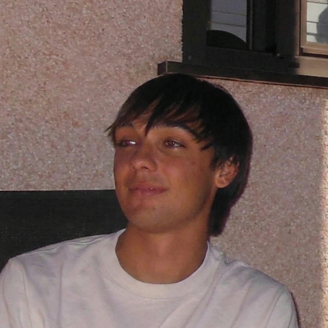
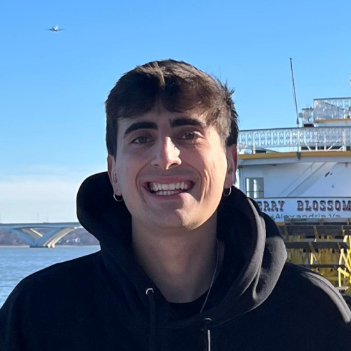
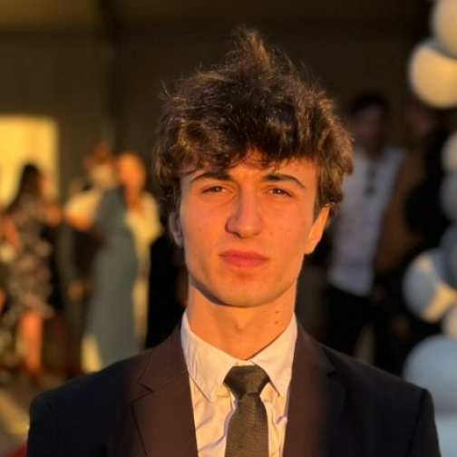
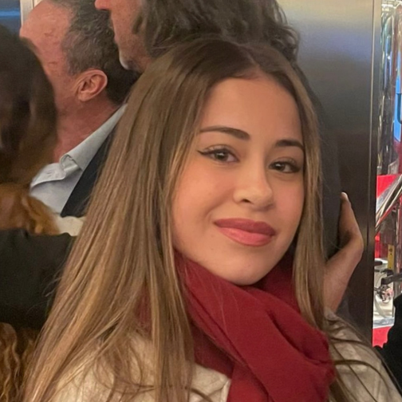
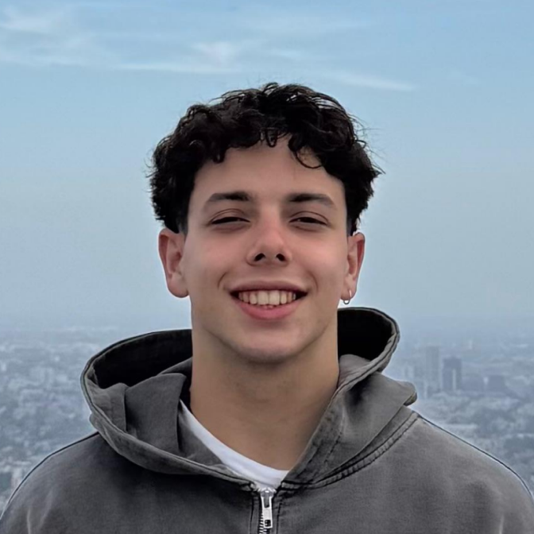

# AISC Madrid - AI Student Collective

  

Welcome to the official repository of **AISC Madrid**, the first AI student association at the Universidad Carlos III de Madrid (UC3M). We are a community dedicated to demystifying AI and fostering practical skills among students.

🌐 **Visit us at:** [aiscmadrid.com](https://aiscmadrid.com/)

---

## About the Project

This repository contains the source code for our official website. The site serves as a hub for:
- **Events:** Stay updated on our latest workshops, talks, and industry meetups.
- **Projects:** Showcasing what our community is building.
- **About Us:** Learning about our mission, values, and history as the first European branch of AISC.
- **Membership:** Forms to join our growing community.

## Technology Stack

The website is built using a modern and lightweight stack:
- **Frontend:** HTML5, CSS3 (Bootstrap 5), and Vanilla JavaScript.
- **Backend:** PHP 8.x for dynamic content management.
- **Database:** MySQL/MariaDB for storing events and member information.
- **Mailing:** PHPMailer for handling contact forms and newsletters.

---

## Meet the Team

Nothing would be possible without the people who make up our team. AISC Madrid brings together students from different fields and ages, fostering a space where creativity and collaboration go hand in hand.

| Hugo Centeno Sanz | Alfonso Mayoral Montero | Lauren Gallego Ropero | Alejandro Barroso Bueso |
| :---: | :---: | :---: | :---: |
|  |  |  |  |
| President | Vicepresident | Vicepresident | Web Developer |

| Yago Cabanes Corvera | Coral Izquierdo Muñiz | Juanjo Rosales Hernando | Xinyi Hu |
| :---: | :---: | :---: | :---: |
|  |  |  |  |
| Administrative and Financial Manager | Webmaster | Web Developer | Web Developer |

| Marta Vallejo Leonor | Álvaro Artano Manso | Daniel Kwapien | Paula Ortega Martín |
| :---: | :---: | :---: | :---: |
|  |  |  |  |
| Digital Marketing | Events and Workshops Coordinator | Events and Workshops Coordinator | Digital Marketing |

| Jaime Lobato Ruiz | Javier Calvo Artaso | Christian Corradini Vila | Lía Lozano Fernández |
| :---: | :---: | :---: | :---: |
|  |  |  |  |
| Web Developer | Events and Workshops Coordinator | Web Developer | Digital Marketing |

  
   
  <strong>Francisco Jimeno Fernández</strong> 
  Digital Marketing

---
